# Expense Tracker
````
I tried to build an app in flutter that can record the transaction we make in our daily life.
It allows the user to track each of his/her everyday transactions, thay may be either income or expense.
It allows the user to group the expenses as per their categories, along with 
the functionality to add own categories that is completely customizable. 
Moreover, the app save your data locally on your device and helps persist the state of app..
	This app uses Hive as local database and Provider for state management.
````
## Download App
````
Why don't you try it once...
  Playstore link ->  https://drive.google.com/file/d/1SKfZWYyIQN6UNYx1iaosPxpzHhhtla39/view?usp=sharing
  
  AppStore link -> Oops! Sorry:(
````  
This app's UI is inspired by the ui provided in dribble by Sagar Panchal < https://dribbble.com/SagarPanchal >

## Note
````
The repository contains the older UI version only, the complete functional app will be soon updated to repository. 
For now, you can download the app and check how it works.
````

 ## Features
	### Money Card
		It displays the full name of user, income and expense amount along with the total balance at top of it in a card view.
	### Add Category
		It doesn't limit users to categorise their transactions only within the provided categories. 
		Instead the app provides feature to add any new category as per the desire of user. 
		New category has name, color and icon, which provides total costumization. 
		Also one should mark if the category is either for income or expense.
	### Edit Category
		Sometimes things go wrong unintentionally. Same can happen when creating new category.
		Don't worry, the app gets you covered. You can change it any time...
	### Delete Category
		Caution!! Are you sure you want to delete it?? All you data regarding that category is lost.
		The transactions you made in that category will persist though..
	### Add Photo and Name
		Well, how can we not have our picture in our app. 
		User can choose any image from gallery and set it as profile photo. 
		Also one can also add his/her name to app. This name is reflected in card.
	### Data Persistance
		Budget Tracker uses hive to store the data locally. It has a well defined mechanism to store any new data to the local storage and then
		fetch data from device. By doing so, it helps to persist the state of app and it's data.
		As a result, neither your photo nor your transaction history is lost unless and until you clear the data of your app..
	### Transaction Chart
		How about a pictorial representation of transaction??
		Well, you can visualize both your income and expenses in a chart, that even categories wise. 
	### Transaction List
		We definitely want to track our expenses of a certain period, like today, this week, this month or as a whole..
		You can do this in the app. You can see your transaction of the day, current week or current month, isolating them from the rest
		of the transactions... Yeah, you can differentiate income and expenses there.
	### Edit Transaction
		Oops!! I made a wrong transaction. Don't worry.. You can edit your transactions any time you want.:)
	### Categories Transaction
		What are the categories for... Definitely for categorising our transactions. So they do the same..
		Also, it displays the total transactions done in that particular category, so you can analyze
		your category with highest and lowest transaction.
	### Dark Mode 
		All screens in the app are designed in both dark and light mode.. Each and every element is controlled respectively to provide 
		promising experience with each theme. I personally love dark mode though... :*
	### Add New Transaction
		Ooop!! How could I not remember this yet? 
		Well, being a transaction tracking app it definitely allows us to add new transactions and delete them as well. 
		One can specify the amount, categoy, date and add a small note about the transaction and you are good to add a new 
		transaction on app. 
	
 ## Dependencies
 ````
  ### money_formatter: ^0.0.3
  ### toggle_switch: ^2.0.1
  ### intl: ^0.17.0
  ### font_awesome_flutter: ^10.1.0
  ### flutter_colorpicker: ^1.0.3
  ### provider: ^6.0.2
  ### image_picker: ^0.8.5+3
  ### hive: ^2.2.3
  ### hive_flutter: ^1.1.0
  ### path_provider: ^2.0.11
  ### path: ^1.8.1
  ### pie_chart: ^5.3.2
  ### hive_generator:  
  ### build_runner: 
 ````

## App Snaps
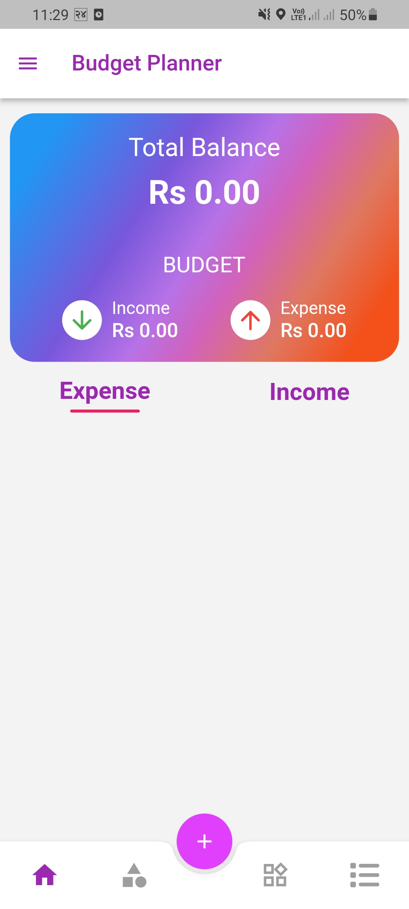 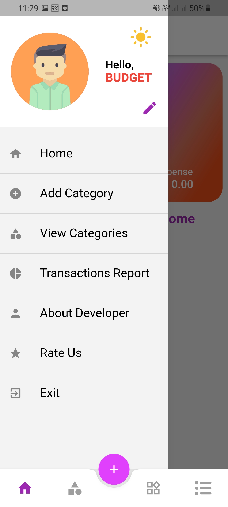 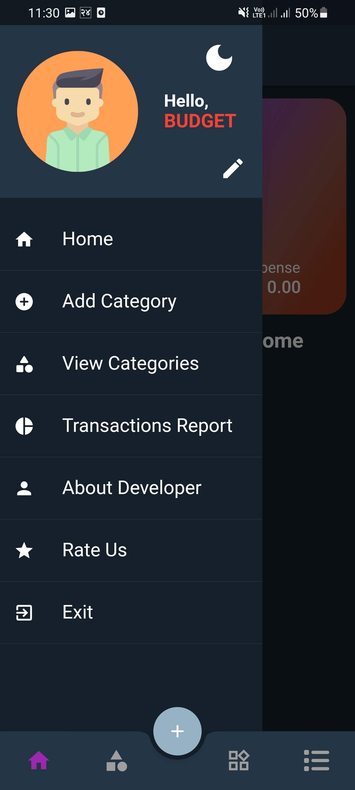
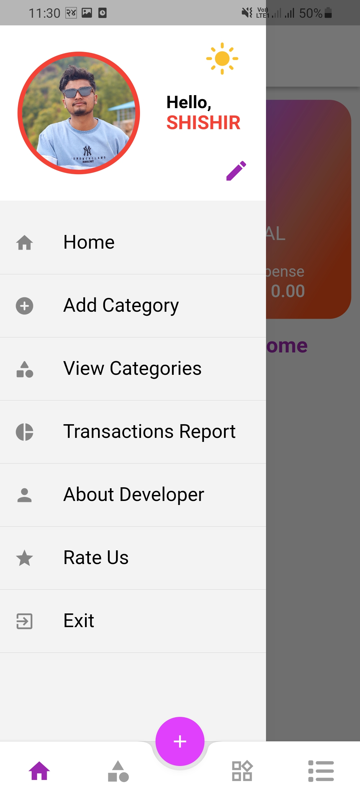


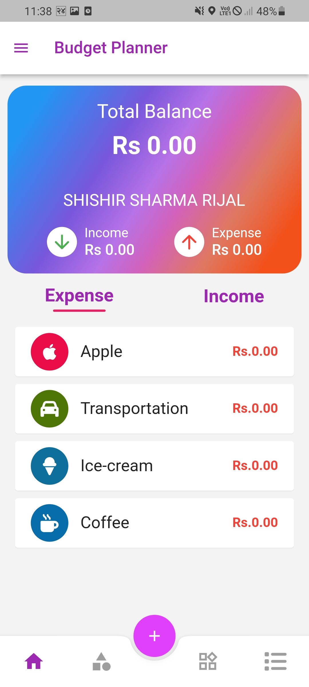
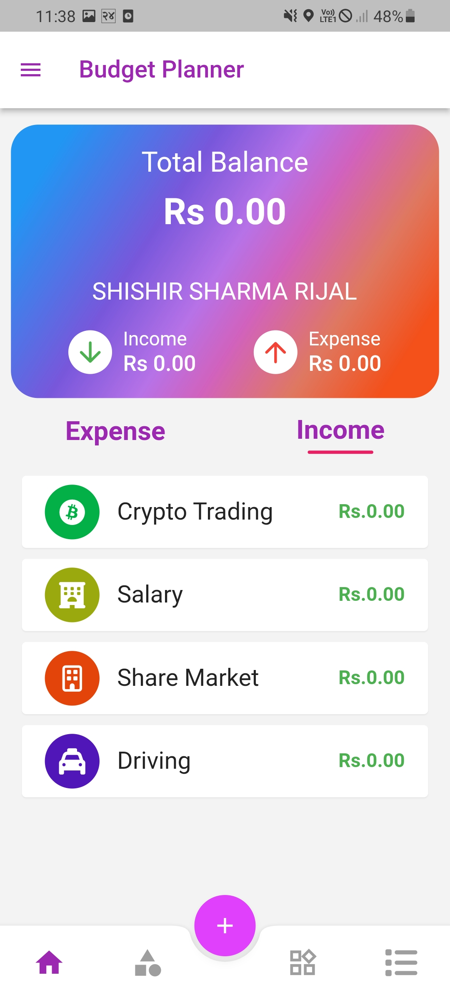
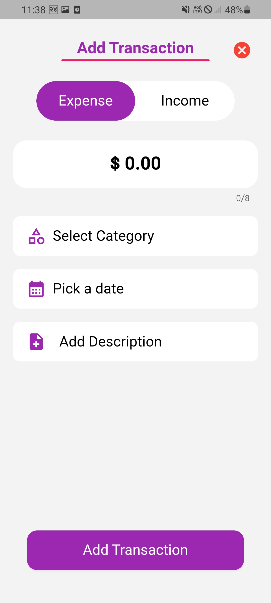

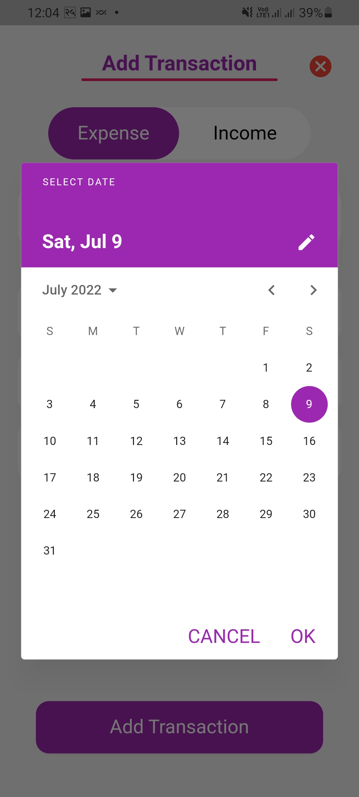
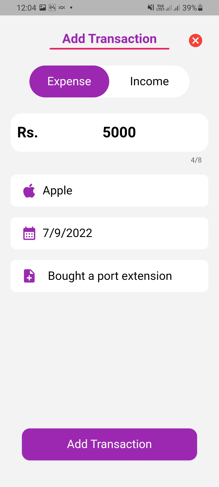
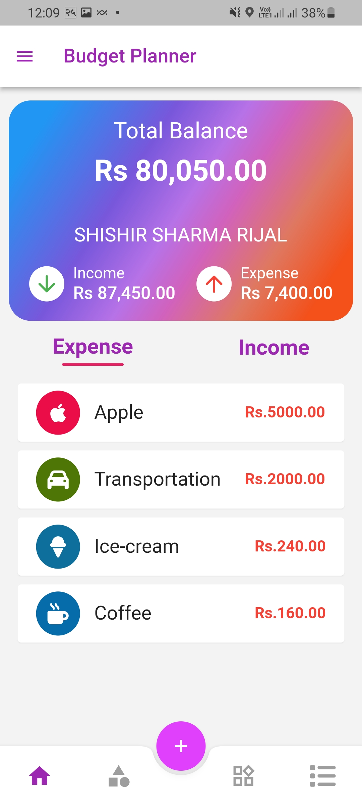
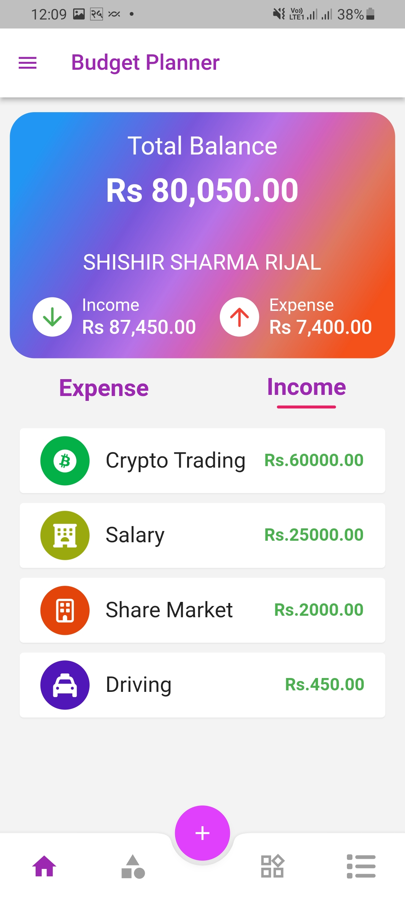
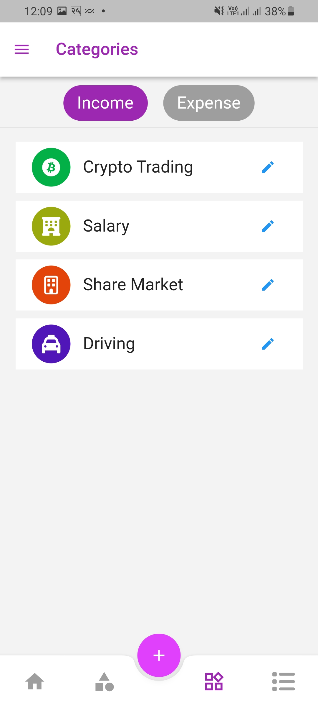
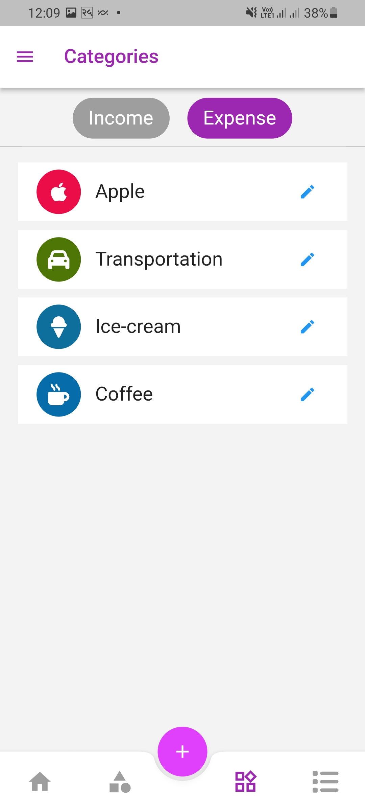
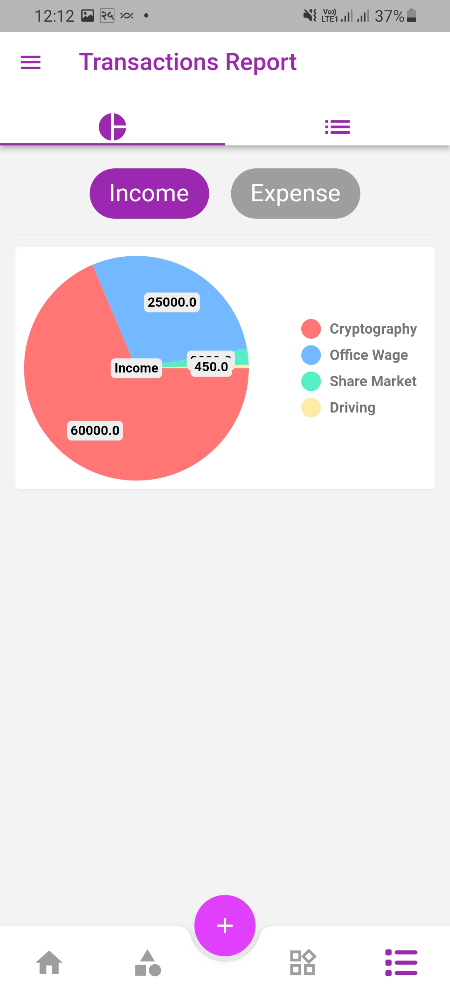
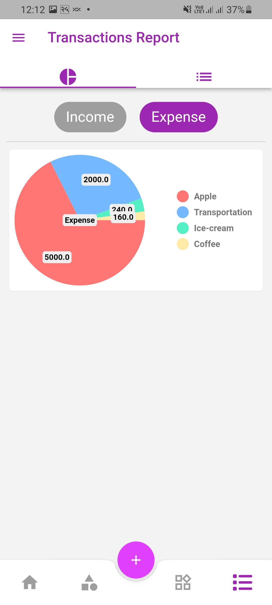
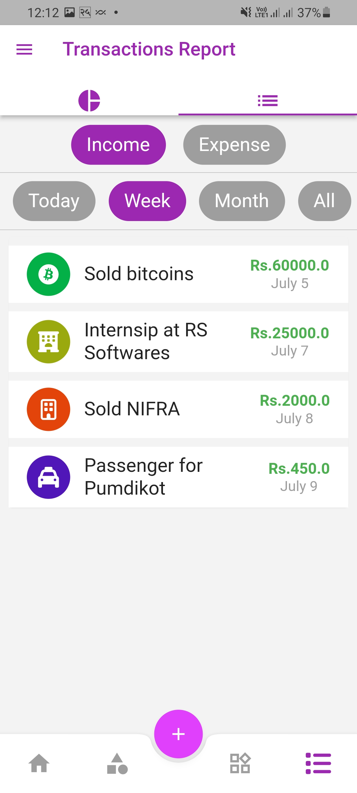
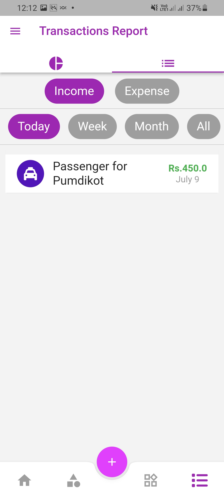
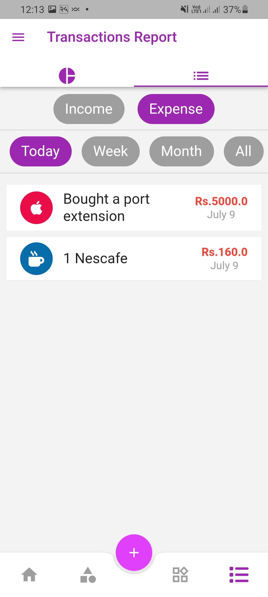

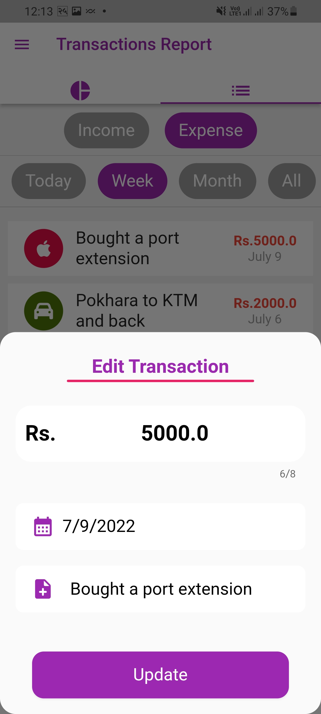
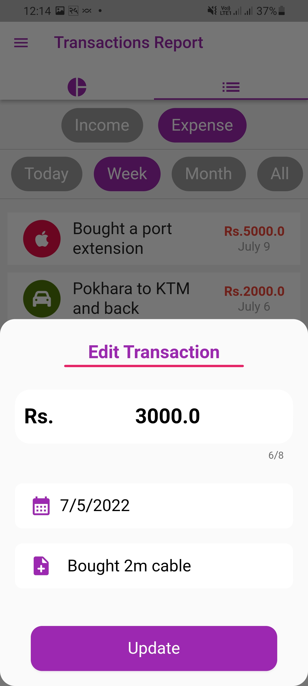
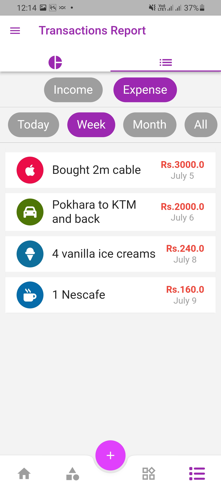


## Note
  This is the new update of this app and it is not currently updated this repository, but soon it will be available in both playstore and repository. :)
  
  
  
